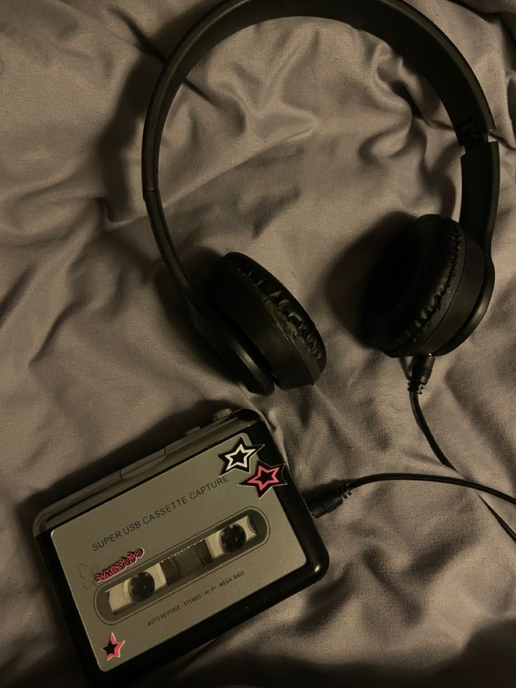

<!DOCTYPE html>
<html lang="id">
<head>
    <meta charset="UTF-8">
    <meta name="viewport" content="width=device-width, initial-scale=1.0">
    <title>Music Player</title>
    
</head>
<body>

    

    

        <h2>SALAHKAH KITA</h2> 
Robinhood

    

    

        

    

    

        0:00
        0:00
    

    

        <button class="btn-side">shuffle</button>
        <button class="btn-side">⏮</button>
        <button class="btn-play" id="play-btn">▶</button>
        <button class="btn-side">⏭</button>
        <button class="btn-side">repeat</button>
    

    <audio id="audio" src="RobinHood feat Asmirandah - Salahkah Kita.mp3"></audio>

</body>
</html>
